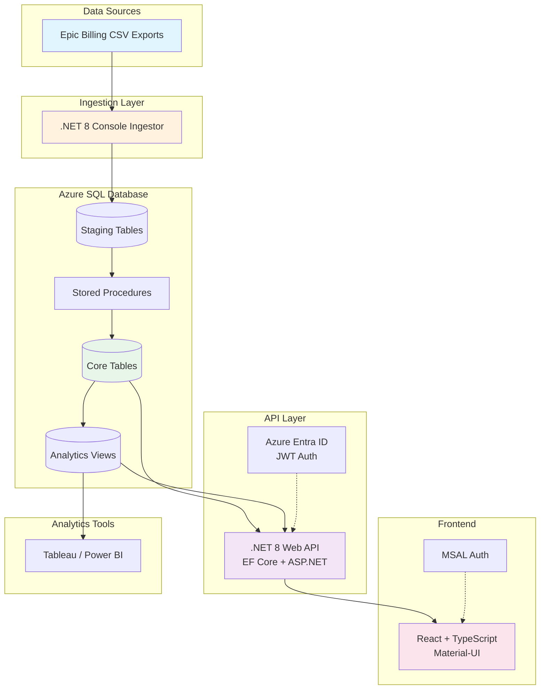

# Epic Billing Analytics & Triage

A comprehensive reference application demonstrating healthcare billing data integration, analytics, and triage workflows. This sample showcases modern architecture patterns for Azure SQL, .NET 8 Web API, and React frontends with enterprise security considerations.

> ⚠️ **DEMO APPLICATION** - Contains synthetic data only. Not for production PHI use.

## Architecture Overview



## Key Features

### 📊 **Data Integration**
- Daily Epic billing extract ingestion (simulated via CSV files)
- Staging tables for raw data loads
- ETL stored procedures for upsert logic
- Automated work queue generation based on business rules

### 🔍 **Triage Workflow (Power Apps-like)**
- Work queue list with filtering and search
- Claim detail view with encounter and patient data
- Assign items to users
- Update status (New → In Progress → Resolved)
- Add triage notes with audit trail
- Edit claim metadata (status, payer)

### 📈 **Analytics & Reporting**
- Tableau-ready dimensional model (facts + dimensions)
- Pre-built analytics views for common metrics
- Work queue overview dashboards
- Denial analysis and payer performance tracking

### 🔒 **Security & Compliance**
- Azure Entra ID (Azure AD) authentication
- Role-based access control (Reader, Analyst, Admin)
- Row-level security design (sample predicate functions)
- Full audit logging for all write operations
- Dev bypass mode for local development

## Quick Start

### Prerequisites
- [.NET 8 SDK](https://dotnet.microsoft.com/download/dotnet/8.0)
- [Node.js 18+](https://nodejs.org/)
- [Docker Desktop](https://www.docker.com/products/docker-desktop) (for local SQL Server)
- [Git](https://git-scm.com/)

### 1. Clone and Setup

```bash
git clone https://github.com/amillen/EpicToAzureSqlIntegraterSample-.git
cd EpicToAzureSqlIntegraterSample-
```

### 2. Start SQL Server

```bash
# Start local SQL Server in Docker
docker-compose up -d

# Wait for SQL Server to be ready (about 10-15 seconds)
docker-compose logs -f sqlserver
# Press Ctrl+C when you see "SQL Server is now ready for client connections"
```

### 3. Initialize Database

```bash
# Run schema scripts (in order)
# Using sqlcmd (if installed):
sqlcmd -S localhost,1433 -U sa -P 'YourStrong!Passw0rd' -d master -Q "CREATE DATABASE EpicBilling"
sqlcmd -S localhost,1433 -U sa -P 'YourStrong!Passw0rd' -d EpicBilling -i sql/01_schema.sql
sqlcmd -S localhost,1433 -U sa -P 'YourStrong!Passw0rd' -d EpicBilling -i sql/02_procs.sql
sqlcmd -S localhost,1433 -U sa -P 'YourStrong!Passw0rd' -d EpicBilling -i sql/03_views.sql
sqlcmd -S localhost,1433 -U sa -P 'YourStrong!Passw0rd' -d EpicBilling -i sql/04_seed.sql

# Or use Azure Data Studio, SSMS, or any SQL client to run the scripts
```

### 4. Run Ingestor (Optional - Seed data already loaded)

```bash
cd src/ingestor
dotnet run ../../sample-data
cd ../..
```

This will:
1. Read CSV files from `sample-data/`
2. Bulk insert into staging tables
3. Execute stored procedures to process into core tables
4. Rebuild the work queue

### 5. Start Backend API

```bash
cd src/api
dotnet run
# API will start on http://localhost:5000
```

### 6. Start Frontend

```bash
cd src/web
npm install  # First time only
npm run dev
# Frontend will start on http://localhost:5173
```

### 7. Access the Application

Open your browser to **http://localhost:5173**

- **Work Queue**: View and filter billing claims requiring attention
- **Claim Detail**: Review claim details, add notes, update status
- **Admin Dashboard**: View analytics and queue metrics

**Dev Mode**: Authentication is bypassed. You're logged in as `dev-analyst@example.com`.

## Project Structure

```
├── docker-compose.yml          # Local SQL Server setup
├── sql/                        # Database scripts
│   ├── 01_schema.sql          # Tables, indexes, schemas
│   ├── 02_procs.sql           # Stored procedures (ETL logic)
│   ├── 03_views.sql           # Analytics views
│   └── 04_seed.sql            # Development seed data
├── sample-data/                # Sample CSV files
│   ├── epic_claims_*.csv
│   └── epic_charges_*.csv
├── src/
│   ├── api/                   # .NET 8 Web API
│   │   ├── Controllers/       # REST endpoints
│   │   ├── Data/              # EF Core DbContext
│   │   ├── Models/            # Domain models & DTOs
│   │   └── Services/          # Business logic (audit, etc.)
│   ├── ingestor/              # .NET 8 Console App
│   │   └── Program.cs         # CSV ingestion logic
│   └── web/                   # React + TypeScript frontend
│       ├── src/
│       │   ├── pages/         # UI pages
│       │   ├── services/      # API client
│       │   └── types/         # TypeScript types
│       └── package.json
└── docs/                       # Documentation
    ├── ARCHITECTURE.md
    └── SECURITY.md
```

## API Endpoints

### Work Queue
- `GET /api/workqueue` - List work queue items (with filters)
- `GET /api/workqueue/{id}` - Get work queue item detail
- `POST /api/workqueue/{id}/assign` - Assign to current user
- `POST /api/workqueue/{id}/status` - Update status
- `POST /api/workqueue/{id}/notes` - Add triage note

### Claims
- `PATCH /api/claims/{claimId}` - Update editable claim fields

### Analytics
- `GET /api/analytics/workqueue-overview` - Work queue metrics
- `GET /api/analytics/claim-financials` - Claim financial details

### Health
- `GET /health` - Health check endpoint

## Data Model

### Core Tables
- **Patient**: Patient demographics (Epic ID, MRN hash, DOB, gender)
- **Encounter**: Hospital encounters (admit/discharge dates)
- **Claim**: Billing claims (payer, amounts, status)
- **ChargeLine**: Line-item charges (CPT codes, denials)
- **WorkQueueItem**: Triage queue (assignment, status, priority)
- **TriageNote**: User notes on claims
- **AuditLog**: Change tracking for compliance

### Staging Tables
- **staging.EpicClaimCsv**: Raw claim file loads
- **staging.EpicChargeCsv**: Raw charge file loads

### Analytics Views
- **vw_WorkQueueOverview**: Queue metrics by status/aging
- **vw_ClaimFinancials**: Claim-level financial rollups
- **vw_ChargeLineDetails**: Detailed charge line analysis
- **vw_DenialAnalysis**: Denial code breakdowns
- **vw_PayerPerformance**: Payer payment statistics

## Work Queue Rules

Claims are automatically assigned to queues based on:

| Queue | Rule |
|-------|------|
| **Denials** | ClaimStatus = 'DENIED' or 'PENDED', OR any ChargeLine has DenialCode |
| **Underpaid** | TotalPaid < TotalAllowed |
| **Clean** | Everything else |

**Priority**: Denials=1, Underpaid=2, Clean=3

## Connecting Tableau

1. Use **Microsoft SQL Server** connector
2. Connect to: `localhost:1433` (or your Azure SQL endpoint)
3. Database: `EpicBilling`
4. Use these views for star-schema modeling:
   - Fact: `vw_ClaimFinancials`
   - Dimensions: Patient, Encounter, WorkQueueItem (via joins)
   - Aggregates: `vw_WorkQueueOverview`, `vw_PayerPerformance`, `vw_DenialAnalysis`

## Configuration

### Backend API (`src/api/appsettings.Development.json`)
```json
{
  "ConnectionStrings": {
    "DefaultConnection": "Server=localhost,1433;Database=EpicBilling;User Id=sa;Password=YourStrong!Passw0rd;TrustServerCertificate=True"
  },
  "DEV_BYPASS_AUTH": true,
  "FrontendUrl": "http://localhost:5173"
}
```

### Frontend (`src/web/.env`)
```env
VITE_API_URL=http://localhost:5000
VITE_DEV_BYPASS_AUTH=true
```

For production, set `DEV_BYPASS_AUTH=false` and configure Azure Entra ID settings.

## Security Notes

See [docs/SECURITY.md](docs/SECURITY.md) for detailed security guidance including:
- Azure Entra ID integration
- Row-level security patterns
- Private endpoints and VNet integration
- Managed identities for ADF/Ingestor
- Key Vault usage

## Development Notes

- **No real PHI**: All data is synthetic. MRNs are pre-hashed.
- **Audit logging**: All updates logged to `AuditLog` table
- **Dev bypass mode**: Skips Entra ID auth for local testing
- **EF Core**: Used for API, but raw SQL for analytics views
- **SqlBulkCopy**: High-performance CSV ingestion

## Testing

```bash
# Backend tests (if added)
cd src/api
dotnet test

# Frontend build
cd src/web
npm run build
```

## Deployment

For production deployment to Azure:

1. **Azure SQL Database**: Create managed instance
2. **App Service**: Deploy API as Linux container or Windows App Service
3. **Static Web App**: Deploy React frontend
4. **Azure Data Factory**: Replace console ingestor with ADF pipelines
5. **Entra ID**: Configure app registrations for API and frontend
6. **Key Vault**: Store connection strings and secrets

See [docs/ARCHITECTURE.md](docs/ARCHITECTURE.md) for detailed deployment guidance.

## License

MIT License - See [LICENSE](LICENSE)

## Contributing

This is a reference sample. Feel free to fork and adapt for your needs.

## Support

This is a demo application. For questions or issues, please open a GitHub issue.
